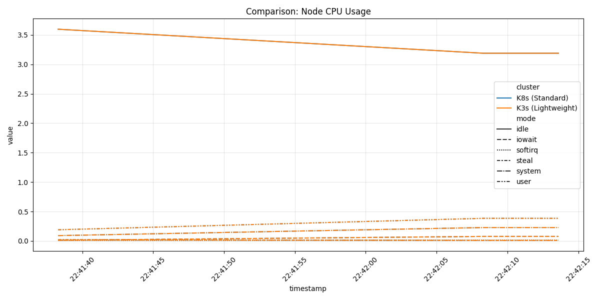
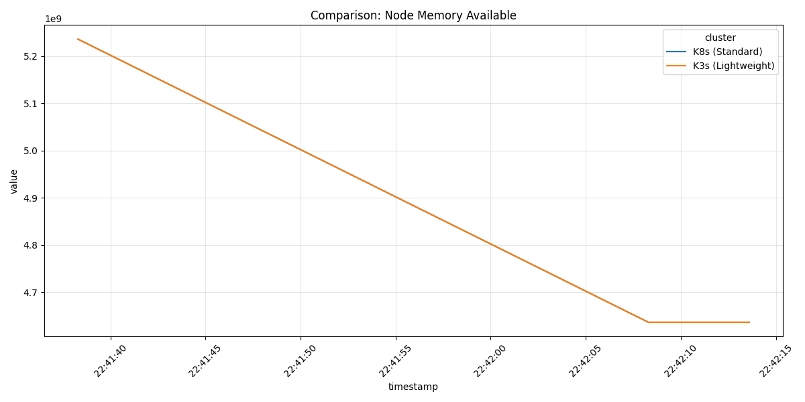
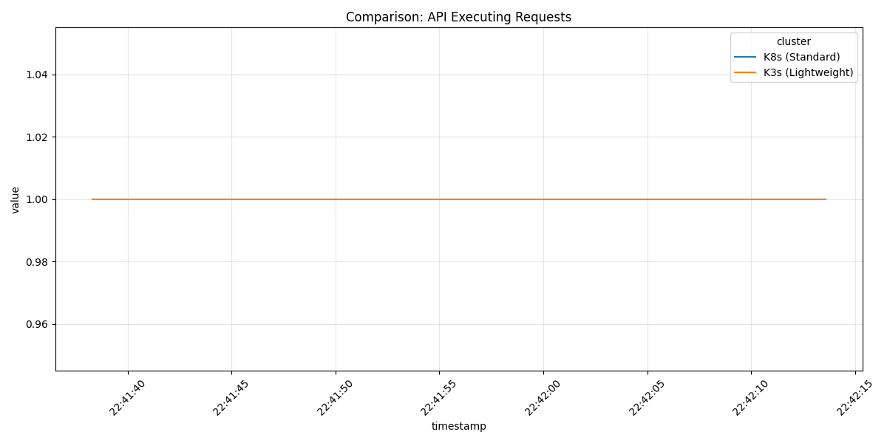
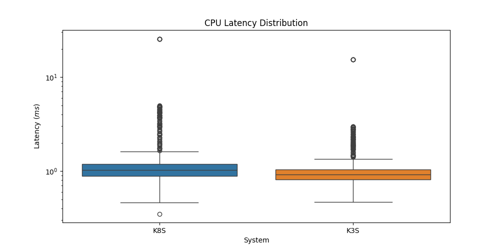

<p align="left">
  <a href="https://github.com/sysgo-embedded/suzeck">
    
  </a>
</p>

## SuzECK project context

This directory is part of the **[SuzECK](https://github.com/sysgo-embedded/suzeck)** open reference materials ([sysgo-embedded/suzeck](https://github.com/sysgo-embedded/suzeck)). **SuzECK** (*Secure, safe, authorized & certifiable Edge & Cloud Key components*) develops a **Safe Computing Platform (SCP)** for safety-critical rail connectivity—from edge to cloud—aligned with the European [OCORA SCP PI API](https://github.com/OCORA-Public/Publications/blob/master/00_OCORA%20Latest%20Publications/Latest%20Release/OCORA-TWS03-030_SCP_Specification_of_the_PI_API_between_Application_and_Platform.pdf). The SCP defines a platform-independent interface between safety-relevant rail applications and cloud/edge platforms, enabling portability across providers while preserving a dedicated safety layer.

The benchmark suite below supports SuzECK by providing reproducible measurements of Kubernetes distributions used in decentralised edge and cloud deployments helping compare orchestration overhead, networking, and control-plane behaviour when sizing infrastructure for safety-related workloads.

### Acknowledgment

The SuzECK project gratefully acknowledges **partial public funding** from **German federal programmes** and the **European Union** (NextGenerationEU), in particular under the Important Project of Common European Interest – Cloud Infrastructures and Services (**IPCEI-CIS**), grant agreement **13IPC023**.

<p align="left">
  
  &nbsp;&nbsp;
  
</p>

---

# K3s vs. Upstream Kubernetes: Automated Performance Benchmark Suite

This suite provides a repeatable, observability-backed benchmark framework for comparing **K3s** and **upstream Kubernetes (K8s)** on equal footing. It automates three measurement domains—node CPU and memory (`sysbench`), CNI throughput and jitter (`iperf3`), and control-plane stress under load (`kube-burner`)—and exports metrics through Prometheus for analysis and side-by-side visualization. Use it to quantify distribution overhead, network efficiency, and API/orchestration limits when choosing or migrating a Kubernetes platform.

## 📂 Repository Structure
| Directory | Description |
| :--- | :--- |
| `benchmarks/` | Raw results (JSON/Logs) from `k3s` and `k8s` test runs. |
| `cluster/` | Cluster-level configurations, FlowControl, and PriorityLevels. |
| `config/` | YAML manifests for Prometheus, Kube-burner jobs, and app deployments. |
| `figures/` | Generated visualizations and comparison plots (PNGs). |
| `scripts/` | Shell scripts for test execution and Python scripts for data plotting. |
| `utils/` | Helper tools, including a Go-based Prometheus remote-write utility. |

---

## 🛠 Technology Stack

This project leverages a modern cloud-native observability and benchmarking stack to ensure high-fidelity data collection and analysis.

* **Orchestration:** K3s & K8s (v1.x.x).
* **Benchmarking Engines:** 
  * `kube-burner`: For API stress and object density.
  * `iperf3`: For high-performance network throughput testing.
  * `sysbench`: For system-level CPU and Memory evaluation.
* **Observability:** 
  * `Prometheus` for metric scraping.
  * `VictoriaMetrics` for remote write to Prometheus.
  * `Grafana` for visual analysis.
* **Data Processing:** Python (Matplotlib/Pandas) for post-test plotting and Go for custom Prometheus remote-write utilities.

## 🚀 Benchmarking Pillars
The suite evaluates performance across three primary domains:

### 1. System & Node Performance (`sysbench`)
Evaluates the raw overhead of the container runtime and orchestration layer on the underlying OS.
* **CPU:** Prime number calculation consistency and tail latency.
* **Memory:** Throughput and footprint distribution.

### 2. Network Throughput (`iperf3`)
Measures the efficiency of the Container Network Interface (CNI).
* **Tests:** Pod-to-Pod and Node-to-Node bandwidth, jitter, and packet loss.
* **Location:** Manifests in `config/network/`.

### 3. Cluster Orchestration (`kube-burner`)
Stresses the API server and Etcd to measure real-world orchestration limits.
* **Metrics:** Pod startup latency, API Flow Control (dispatched vs. executing), and resource consumption during high churn.
* **Density:** Measures cluster behavior when scaled to maximum pod capacity.

---

## 📊 Getting Started

### Prerequisites
* A running Kubernetes cluster (K3s and vanilla K8s).
* Python 3.x with `pip` (for plotting).
* `kubectl` configured with cluster-admin access.

### 1. Run Benchmarks
Automated execution scripts are located in `scripts/tests/`. Run them individually based on your requirements:

```bash
# Run system-level CPU and Memory tests
cd scripts/tests/ && ./sysbench.sh && cd ../..
```
```bash
# Run network performance tests
cd scripts/tests/ && ./iperf3.sh && cd ../..
```
```bash
# Run cluster density and API stress tests
cd scripts/tests/ && ./kube-burner.sh [dev|prod] [es|local] && cd ../..
```

### 2. Generate Visualizations
After the tests complete, the results are stored in the `benchmarks/` directory. Use the Python plotting suite to generate comparison graphs:

```bash
# Create a python virtual environment
cd scripts/plots/
python3 -m venv .venv && source .venv/bin/activate

# Install dependencies
pip install -r requirements.txt

# Generate Kube-burner comparison plots
python3 kube_burner.py

# Generate Network performance plots
python3 iperf3_network.py

# Return to root directory
cd ../..
```
Outputs will be saved to the `figures/` directory.

## 📈 Monitoring & Data Export
The suite is designed to integrate with **Prometheus**.
* **Metrics Retrieval**: `config/k8s/prometheus/` contains the necessary configurations to scrape benchmark metrics.

* **Remote Write**: The `utils/remote-write/` utility allows you to push local JSON benchmark results to a remote Prometheus/VictoriaMetrics instance for long-term retention and historical analysis.

## 📈 Benchmark Visualizations

Below are sample comparisons generated by the internal plotting engine using data from the `benchmarks/` directory.

### Node Resource Comparison
| CPU Usage Comparison | Memory Availability |
| :---: | :---: |
|  |  |

### API & Latency Analysis
| API Executing Requests | CPU Latency Distribution |
| :---: | :---: |
|  |  |

## 🛡 License
This project is licensed under the [LICENSE](./LICENSE) file included in this repository.

Currently **Apache License Version 2.0**.
